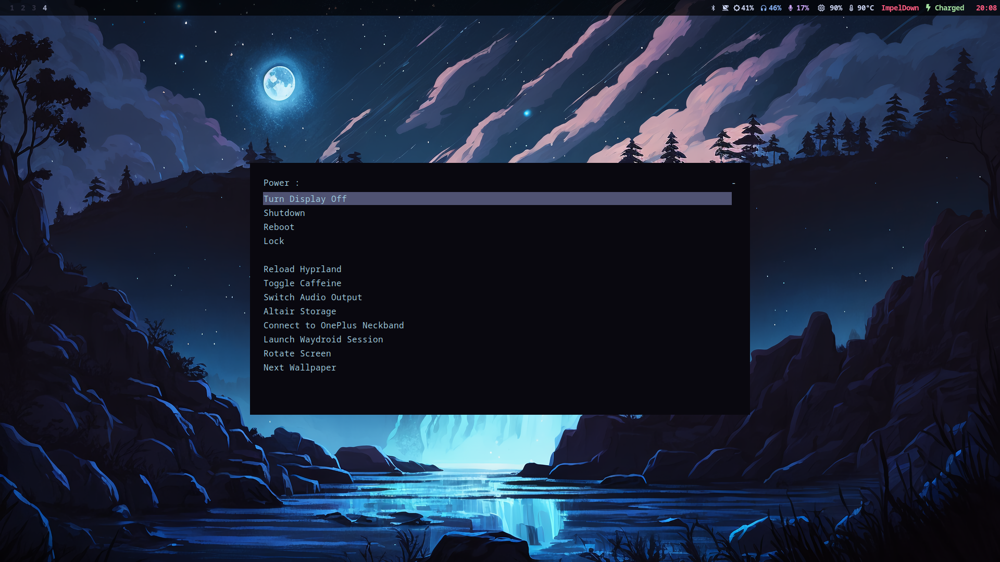

## Hyprland Rice

### Packages used

* [Hyprland](https://hyprland.org/)
* [Waybar](https://github.com/Alexays/Waybar)
* [Wayland fork of Rofi](https://github.com/lbonn/rofi)
* [zsh](https://archlinux.org/packages/extra/x86_64/zsh/)
* [Dunst](https://archlinux.org/packages/community/x86_64/dunst/)

## Custom Scripts

Copy the `Scripts` to the environment variable paths or set the path to the `Scripts` folder location.

#### Fonts used
* [Font Awesome 5](https://fontawesome.com/download)
* [Iosevka Nerd Font](https://github.com/ryanoasis/nerd-fonts/blob/master/patched-fonts/JetBrainsMono/Ligatures/Regular/complete/JetBrains%20Mono%20Regular%20Nerd%20Font%20Complete%20Mono.ttf)
